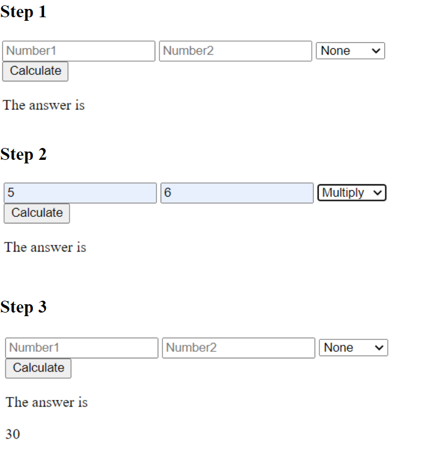

# PHP_Calculator
## Description

Step by step images of a calculator I built using PHP.

### Tools/Technologies
- PHP
- HTML
```HTML code
<form>
	<input type="text" name="num1" placeholder="Number1">
	<input type="text" name="num2" placeholder="Number2">
	<select name="operator">
		<option>Multiply</option>
	</select>
	<br>
	<button type="submit" name="submit" value="submit">Calculate</button>
</form>
```

```PHP calculator code
 <?php
		if(isset($_GET['submit']))
			{
				$result1 = $_GET['num1'];
				$result2 = $_GET['num2'];
				$operator = $_GET['operator'];
				switch($operator)
					{
						case "None":
                            echo "You need to select operator";
                        case "Multiply":
							echo  $result1 * $result2;
						break;
                    }
            }
 ?>    
```



## License
- N/A 

## Author Info
- Linkedin - [Aaron Parnell](https://www.linkedin.com/in/aaron-parnell-1ab4661b3/)
- Github - [aparnell0130](https://github.com/aparnell0130)

[Back to top](#PHP_Calculator)
