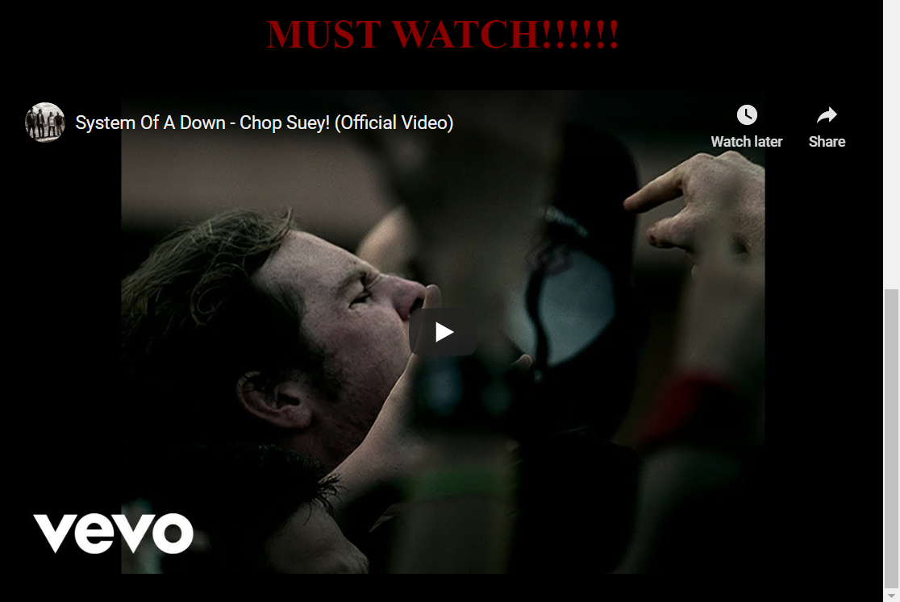

# System_of_a_Down_Fan_Page
## Description

This is a System of a Down Fan Page I created for my pre-work to the course. The code is a little rough because I did this before I had any experience with CSS

### Tools/Technologies
- HTML
- CSS

```HTML embedded video
  <h2 class="blink"> MUST WATCH!!!!!!</h2>
        <iframe width="853" height="480" src="https://www.youtube.com/embed/CSvFpBOe8eY" frameborder="0" allowfullscreen ng-show="showvideo"></iframe>
```



## License
- N/A 

## Author Info
- Linkedin - [Aaron Parnell](https://www.linkedin.com/in/aaron-parnell-1ab4661b3/)
- Github - [aparnell0130](https://github.com/aparnell0130)

[Back to top](#System_of_a_Down_Fan_Page)